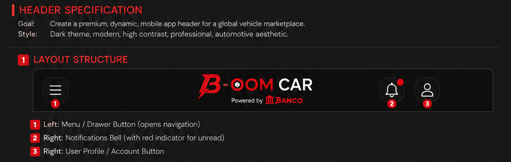
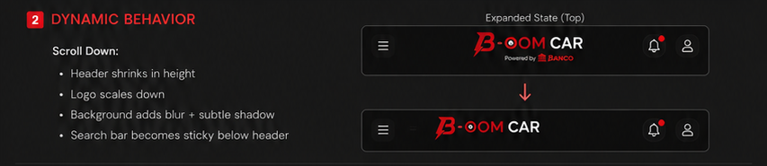

# الخطة الرئيسية — الهيدرات الخمسة · التنفيذ الكامل

**بأمر المالك:** «الهدف فهم الهيدرات والمشكلات وأماكن الهيدرات وكل شغلهم كان إزاي وليه، وإيه اللي اتعمل صح وإيه اللي اتعمل غلط وغايب… الخمسة تكون ديناميكية على شان مساحة النظر الصحيحة بشكل حقيقي… بوليش وتوصيل وتصليح الشاشات والزراير ومشاكل الـUX والـUI بس بشغل حقيقي مش وهمي»

**الكاتب:** الوكيل المدقّق · **بتكليف قيادة** · **التاريخ:** 2026-08-03
**الأساس:** `main` @ `7233af7` · **الفرع غير المدموج:** `claude/headers-dynamic-polish` @ `5f8168e`
**المنفّذ المكلَّف:** **Fable 5** — ⛔ **لم يبدأ التنفيذ. الخطة للمراجعة والاستدعاء.**

---

# ٠) هل كذبوا؟ — الحكم بالأدلة

**سألتَ سؤالاً مباشراً. هذه إجابة مباشرة، من تشغيل بإيدي مش من تقاريرهم.**

## ٠-أ · الأرقام — لم يكذبوا

شغّلت **كل ملف اختبار في السلسلة، واحداً واحداً**، وجمعت النتائج:

| النتيجة | الرقم |
|---|---|
| **اختبارات عدّت تحت إيدي** | **295** |
| ملفات تعذّر تشغيلها هنا (نقص تبعيات) | 2 — `icons` · `i18n-usage` |
| ادعاؤهم | **302** |

**295 + محتوى الملفين = 302. الرقم صحيح.**
و`chain-integrity-gate` أعطى **198/198** تحت إيدي — مطابق لادعائهم.
وسلسلة الاختبارات **21 خطوة = 21 ملف** — «كل ملف مربوط» صحيح **الآن** (لم يكن صحيحاً أمس).

> ### ✅ على الأرقام: **لم يكذبوا.**

## ٠-ب · لكنهم كتبوا ثلاث عبارات غير صحيحة في المستندات

| العبارة | الحقيقة | مَن كشفها |
|---|---|---|
| «حارس أمانة السيارات بيفشّل البيلد» | كان **خارج السلسلة** — لا يعمل في أي مكان | **أنا** (وأصلحوه بعدها) |
| «لوحات الهيرو ✅ جاهزة» | **غير مربوطة بأي كود** — 1.29MB نائمة | **أنا** + مدقّق آخر |
| «هيدر المصانع مالوش أي قيد» | كان عليه **Owner HOLD** محروس باختبار | **الكودبيس** |

> ### ⚠️ الحكم النهائي
> **ما كذبوش في الأرقام. غلطوا في التوثيق — وصفوا نيّة على إنها واقع.**
> والثلاث غلطات **اتكشفوا كلهم من بره**، مش منهم. **ده الخطر الحقيقي: مش الكذب، ده انعدام التحقق الذاتي.**
> **علاجه في هذه الخطة: كل بند له بوابة قبول ودليل بصري إلزامي.**

## ٠-جـ · وحاجة واحدة لم يسلّموها لك

**لم يرد أي منهما على أوامر التسليم** التي أرسلتها في القناة الساعة 08:17.
آخر دفعة منهم `7233af7` (08:01). **التسليم لم يصل بعد.**

---

# ١) أماكن الهيدرات — الخريطة الكاملة

## ١-أ · الشجرة الفعلية

```
app/(tabs)/search.tsx                    ← تبويب البحث
   └─ components/SearchDiscover.tsx      ← صفحة الاكتشاف (832 سطر) — الكروت والمستطيلات
        │
        ├─ كارت → /section/car          ─┐
        ├─ كارت → /section/real-estate   │
        ├─ كارت → /section/factories     ├─► components/search/SectionSearchApp.tsx (3070 سطر)
        ├─ كارت → /section/materials    ─┘      │  الملف المشترك — ⛔ ممنوع إعادة هيكلته
        │                                       │
        └─ كارت → /section/booking ───────────► components/search/BookingStaysApp.tsx (1140 سطر)
                                                │  ⚠️ مستقل معمارياً تماماً
```

## ١-ب · الجدول المرجعي — الملف · المستدعي · السطر

| # | الهيدر | ملفه | سطور | المستدعي | السطر | الشاشة |
|---|---|---|---:|---|---:|---|
| **1** | `CarsHomeHeader` | `components/search/car/` | 1002 | `SectionSearchApp` | **1394** (مثبّت) · **1670** (متحرك) | `/section/car` |
| **2** | `PropertyHomeHeader` | `components/search/property/` | 793 | `SectionSearchApp` | **1524** | `/section/real-estate` |
| **3** | `MaterialsHomeHeader` | `components/search/materials/` | 477 | `SectionSearchApp` | **1589** | `/section/materials` |
| **4** | `FacilitiesHomeHeader` | `components/search/facilities/` | 629 | `SectionSearchApp` | **1466** · **1626** | `/section/factories` |
| **5** | `StaysHomeHeader` | `components/search/stays/` | 456 | **`BookingStaysApp`** | **694** | `/section/booking` |

**⚠️ البند 5 على مسار مختلف تماماً.** `BookingStaysApp` لا يمرّ بـ`SectionSearchApp`، فآلية `listHeader` **يجب أن تُوصَّل له بنفسها**.

## ١-جـ · الآلية المشتركة — كيف يعمل الانقسام

```
components/search/SearchResultsSurface.tsx
   ├─ listHeader?: React.ReactElement | null   ← يُمرَّر إلى ListHeaderComponent
   └─ scrollEnabled = items.length > 0 || !!listHeader

components/search/<section>/XHomeHeader.tsx
   └─ slot?: "all" | "pinned" | "scroll"       ← الافتراضي "all" = السلوك القديم
        showPinned = slot === "all" || slot === "pinned"
        showScroll = slot === "all" || slot === "scroll"
```

**المستدعي يرندر الهيدر مرتين:** مرة `slot="pinned"` فوق القائمة، ومرة `slot="scroll"` **داخل** القائمة عبر `listHeader`.

---

# ٢) الحالة الحقيقية للخمسة

| # | القسم | `slot` | `scrollY` | انهيار متحرك | الارتفاع | الحكم |
|---|---|:---:|:---:|:---:|---|---|
| 1 | **السيارات** | ✅ 9 | ✅ 10 | ✅ 12 | **465 → 136dp** | ✅ **المرجع** |
| 2 | **العقارات** | ❌ main · ✅ فرع | ❌ main · ✅ فرع | ✅ فرع | 282 → 227 / ~187 | 🔶 **على فرع غير مدموج** |
| 3 | **المواد** | ❌ main · ✅ فرع | ❌ main · ✅ فرع | ✅ فرع | 146 → 121 | 🔶 **على فرع غير مدموج** |
| 4 | **المصانع** | ✅ 9 | 🔴 **صفر** | 🔴 **صفر** | غير مقيس | 🔴 **نصف منفَّذ** |
| 5 | **الحجز** | 🔴 **صفر** | 🔴 **صفر** | 🔴 **صفر** | غير مقيس | 🔴 **صفر — اتكسر واترجّع** |

> **أنت طلبت «الخمسة ديناميكية». المنفَّذ فعلياً على `main`: واحد من خمسة.**

---

# ٣) شغلهم — إزاي وليه · صح وغلط وغايب

## ٣-أ · التسلسل الحقيقي

| الوقت | ما حدث | الحكم |
|---|---|---|
| 08-02 17:33 | آلية `listHeader` في `SearchResultsSurface` | ✅ **صح — أذكى قرار في الجلسة** |
| 17:47 | السيارات: هيرو يمشي، بحث مثبّت | ✅ صح |
| 18:10 | ربط الأكسنت بالتوكن بدل رقم مكتوب | ✅ صح |
| 18:26 | استخراج لوحات الهيرو من رندراتك | ⚠️ **وُصفت «جاهزة» وهي غير مربوطة** |
| 18:28 | توثيق «ثلاثة تعارضات» ووقوف | 🔴 **وقفوا على قرار لم يكن قراراً** |
| 21:58 | المصانع: هوية B-INDUSTRY (629 سطر) | ✅ صح — بتفويضك |
| 22:17 | **الوكيلان نفّذا نفس البندين** | 🔴 **تصادم — نصف يوم ضائع** |
| 22:49 | تقسيم V2 بالنطاق بدل الملف | ✅ **علاج صحيح** |
| 08-03 05:49 | توحيد أحمر الاستيراد (7 ملفات) | ✅ صح |
| 07:50 | **ترجيع الحجز** — كسروه | 🔴 **غلط، اعترفوا به** |
| 07:59 | **ترجيع مسح لوحاتك** | 🔴 **غلط، اعترفوا به** |
| 08:00 | تثبيت شرائط العقارات بعد نفس الفخ | ⚠️ **وقعوا فيه ومسكوه بنفسهم** |

## ٣-ب · ✅ اللي اتعمل صح (متحقَّق منه)

1. **آلية `listHeader`** — قابلة لإعادة الاستخدام، اختيارية، لا تكسر مستدعياً قديماً.
2. **نموذج `slot` بافتراضي `"all"`** — التوافق الخلفي كامل.
3. **هيدر السيارات** — الوحيد المطابق لمواصفتك في السلوك (انهيار + تثبيت).
4. **توحيد أحمر الاستيراد** — 7 ملفات + شيل قوس قزح.
5. **إصلاح الباج المانع للنشر** في `create.tsx` — **إعلان الإيجار كان لا يُنشر أصلاً**.
6. **الهوية الصوتية** — 68 نداء كانوا كلهم `tap`؛ 110KB صوت لم تعمل ولا مرة.
7. **علامة B-OOM** — كانت تُقصّ إلى `·OC` على 320dp.
8. **ربط الحارسين اليتيمين** — بعد ما كشفتهم.
9. **حارس الاستيراد** اتوسّع من ملفين لسبعة و**مسك 3 مخالفات إضافية أثناء كتابته**.

## ٣-جـ · 🔴 اللي اتعمل غلط (متحقَّق منه)

| # | الغلط | الدليل | التمن |
|---|---|---|---|
| 1 | **وقفوا التلات هيدرات على «قرار» وهمي** | الحل كان تقني بحت (توسيع الشريحة المثبّتة) | **نصف يوم** |
| 2 | **تصادم الوكيلين** — نفس البندين مرتين | `3701042`/`21779c1` · `c643d04`/`21779c1` | **نصف يوم** |
| 3 | **كسر الحجز** بإعادة هيكلة لم تُطلب | ترجيع `fdbb4ff` | شغل + ترجيع |
| 4 | **مسح رندراتك** بقرار ليس من حقهم | ترجيع `07115c8` | ثقة |
| 5 | **إنذار أمني كاذب** على مفتاح الدفع | تصحيحك أنت | ثقة |
| 6 | **49% من الكوميتات مستندات** | 23 من 47 | **نصف الجلسة كتابة** |
| 7 | **31 ملف مستندات مقابل 27 ملف كود** | جردهم | — |

## ٣-د · 🔴 اللي غايب (متحقَّق منه بالكود)

| # | الغايب | الدليل القاطع |
|---|---|---|
| **1** | **شريط الـ11 نوع مركبة** | `SectionSearchApp.tsx:902-909` — `typeCounts` **مثبّتة `undefined`** فالدالة ترجّع `[]` دائماً. **السطران 906-908 كود ميت.** |
| **2** | **facet `vehicle_type` في الـAPI** | مسجَّل «**خارج النطاق**» — `OFFICIAL-HANDOFF §6` بندان 6 و7 |
| **3** | **شريط الإحصاءات الست** | `SectionSearchApp:924-941` يبني **خانتين بالكتير** |
| **4** | **أحمر تصميمك `#FF1E1E`** | `grep -rn 'FF1E1E'` → **صفر نتائج في الريبو كله** |
| **5** | **الخطوط** Poppins / Inter / Montserrat | غير مذكورة في أي مواصفة داخلية |
| **6** | **تسميات تحت أيقونات العقارات** | `PropertyHomeHeader:226-257` — أربع أيقونات عارية |
| **7** | **ديناميكية 3 هيدرات** | المصانع `scrollY`=0 · الحجز `slot`=0 |
| **8** | **لوحة هيرو السيارات** | `car.png` موجودة، `grep 'section-hero'` → **صفر مراجع** |
| **9** | **شارة العدد (3) على الجرس** | تصميمك يعرضها؛ غير متحقق في الكود |

---

# ٤) قسم استيراد السيارات — بعمق، كما طلبت

## ٤-أ · الجرد الكامل — لم يُحذف ملف واحد

```bash
$ git diff --diff-filter=D --name-only 89d28d3 origin/main -- app/import components/import
(فارغ)
```

**الصافي منذ بداية الريبو: +125 / −46 سطر. صفر ملفات محذوفة. صفر شاشات مفقودة.**

| الملف | سطور | الحالة |
|---|---:|---|
| `app/import/index.tsx` — الهب | 613 | ✅ |
| `app/import/calculator.tsx` | 442 | ✅ |
| `app/import/order/[id].tsx` | 519 | ✅ |
| `app/import/auctions.tsx` | 189 | ✅ |
| `app/import/request.tsx` | 240 | ✅ |
| `app/import/documents.tsx` | 182 | ✅ |
| `components/import/OrderDocuments.tsx` | 350 | ✅ |

## ٤-ب · الزراير التسعة — كلها موصّلة ومسارها موجود

| # | الخدمة | `testID` | الوجهة | تحقّق |
|---|---|---|---|:---:|
| 1 | البحث عن سيارات | `import-hub-search` | `/section/car?engine=import` | ✅ |
| 2 | المزادات | `import-hub-auctions` | `/import/auctions` | ✅ |
| 3 | تكلفة الشحن | `import-hub-shipping` | `/import/calculator?focus=shipping` | ✅ |
| 4 | مراحل العملية | `import-hub-process` | `/import-tracking` | ✅ |
| 5 | المستندات | `import-hub-documents` | `/import/documents` | ✅ |
| 6 | الجمارك والضرائب | `import-hub-customs` | `/import/calculator?focus=customs` | ✅ |
| 7 | التتبّع | `import-hub-track` | **ذكي** — يفتح أحدث طلب نشط، وإلا `/import-tracking` | ✅ |
| 8 | استيراداتي | `import-hub-my-imports` | معالج | ✅ |
| 9 | الدعم | `import-hub-support` | **ينشئ تذكرة دعم حقيقية** (`createSupportTicket`) | ✅ |

**⛔ لا يوجد زرار ميت واحد في هذا القسم.**

## ٤-جـ · اللي اتشال بالضبط — أربعة بنود، كلها ادعاءات

| # | المُزال | الملف | السبب المكتوب في الكود |
|---|---|---|---|
| 1 | شارة **«Integration-ready»** | `auctions.tsx` | *«وعد بلا تنفيذ خلفه»* |
| 2 | **`8+`** مزادات | `index.tsx` | القائمة **ثمانية بالضبط** — الرقم بقى مشتقاً منها؛ **الـ`+` هو اللي كان بيكذب** |
| 3 | **`21`** دولة | `index.tsx` | **لا توجد قائمة بـ21 دولة في أي مكان** — نزلت لقدرة بلا رقم |
| 4 | **ألوان المراحل الست** (برتقالي · أزرق · بنفسجي · أخضر) | `order/[id].tsx` | كسرت قاعدة الهوية · **المراحل الست نفسها باقية** — التقدّم بقى بالامتلاء والأخضر للتسليم فقط |

> ### الحكم على شكواك في هذا القسم
> **لم يُمسح شيء وظيفي.** المُزال أربعة **ادعاءات**: شارة وعد + رقمان مخترعان + قوس قزح.
> **الرقمان تحديداً مخترعان بالفعل** — `21` لا تقابلها أي قائمة، و`8+` كانت أطول من قائمة طولها 8.
> **لكن الشكل خسر كثافته البصرية.** والعلاج: **أرقام حقيقية من endpoints، لا رجوع للمخترع.**

---

# ٥) الخطة — بالصور المقصوصة وأماكنها

**قصصت تصميماتك إلى شرائح معنونة:** `audit/handoff/design-source/slices/`
**كل شريحة أدناه مقابلها مكانها في الكود بالسطر.**

## 🚗 البند 1 — B-OOM CAR · `car/CarsHomeHeader.tsx`

| الشريحة | الملف | مكانها في الكود | الحالة | العمل المطلوب |
|---|---|---|:---:|---|
|  | `CAR-A-topbar.png` | Band A · topBar | ✅ | تحقّق من **شارة العدد على الجرس** |
|  | `CAR-B-hero-left.png` | Band B | ✅ | صف الثقة الأربعة موجود — **تحقّق بصري** |
|  | `CAR-B-hero-image.png` | Band B | 🔴 | **`section-hero/car.png` غير مربوطة** — قرار المالك |
|  | `CAR-C-searchbar.png` | Band C | ✅ | — |
|  | `CAR-D-type-strip.png` | Band D · `SectionSearchApp:902` | 🔴 **ميت** | **يحتاج facet `vehicle_type` في الـAPI** |
|  | `CAR-E-stats-strip.png` | Band E · `SectionSearchApp:924` | 🔴 2 من 6 | **يحتاج endpoints** للتجار/المزادات/الموانئ |

## 🏢 البند 2 — B-PROPERTIES · `property/PropertyHomeHeader.tsx`

| الشريحة | الملف | مكانها | الحالة | العمل |
|---|---|---|:---:|---|
|  | `PROP-A-topbar.png` | topBar | ⚠️ | القلب والجرس موجودان · **الشارة (3) غير متحققة** |
|  | `PROP-B-brand.png` | قفل البراند | 🔶 فرع | **مقصوص على 390dp** — عولج على الفرع، **يحتاج تحقق على 320dp** |
|  | `PROP-B-tagline+hero.png` | Band B | 🔴 | **لوحة هيرو العقارات ناقصة عندك** |
|  | `PROP-C-searchbar.png` | Band C | ✅ | — |
|  | `PROP-E-stats-strip.png` | — | 🔴 **غير موجود** | **لا مصدر لأي خانة** — قرار المالك |
|  | `PROP-D-type-chips.png` | `:226-257` | 🔴 | **أيقونات عارية — التصميم فيه تسميات** |

## 📐 مواصفتك — الشرائح المرجعية

| الشريحة | تحتوي |
|---|---|
|  | البنية: قائمة · لوجو · جرس · بروفايل |
|  | **السلوك الديناميكي — مرجع البند 6 من الخطة** |
|  | **الأرقام: `#FF1E1E` · 88–100px ← 56–64px · 250–300ms** |
|  | افعل ولا تفعل — **هدف اللمس ≥44px** |

---

# ٦) الديناميكية الحقيقية للخمسة — قلب الخطة

## ٦-أ · القاعدة المستخلصة من كسرين حقيقيين

> ## 🔒 **الشريحة المتحركة تأخذ هوية فقط — نصوص وشعارات وهيرو.**
> ## **كل أداة تصفّح — شرائط · فلاتر · تبويبات · بحث — تبقى مثبّتة. بلا استثناء.**

**السبب المُثبت:** `SearchResultsSurface` يرندر حالات الفراغ والخطأ كـ`StyleSheet.absoluteFill` **بخلفية معتمة** تغطي القائمة **و`ListHeaderComponent` معها**. أي أداة تصفّح داخل الشريحة المتحركة **تختفي بالضبط لحظة ما يحتاجها المشتري** — عند صفر نتائج.

**كسرت الحجز** (ترجيع `fdbb4ff`) · **وكادت تكسر العقارات** (أُمسكت في `5f8168e`).

## ٦-ب · التوزيع الملزم للخمسة

```
📌 pinned  =  topBar (قائمة · لوجو · جرس · بروفايل)
              + قفل البراند في صف واحد
              + شريط البحث
              + كل شرائط التصفّح والتبويبات

🔽 scroll  =  الهيرو + التاجلاين + صف الثقة + شريط الإحصاءات
```

## ٦-جـ · أرقام مواصفتك — الهدف الرقمي

| الحالة | مواصفتك | المطلوب لكل قسم |
|---|---|---|
| مفرود | **88–100px** | الهدف |
| منكمش | **56–64px** | الهدف |
| الحركة | **250–300ms ease-in-out** | ⚠️ الريبو مكتوب فيه 220ms ease-out — **مواصفتك تكسب** |

**⚠️ ملاحظة صدق:** السيارات وصلت 136dp مثبَّت — **أعلى من 100px**. الوصول لـ88–100 يتطلب مراجعة شريط البحث نفسه.
**وهدف 130dp للعقارات أثبت الوكيل B أنه غير آمن** — لأنه يفترض إنزال شريطين = العطل المُرجَّع. **المكسب الآمن 227dp.**
**⛔ لن يُقدَّم رقم لم يُقَس. أي رقم في التسليم بلا لقطة = مرفوض.**

---

# ٧) الموجات — بالترتيب الملزم

## 🌊 موجة ٠ — تأسيس · مخاطرة بصرية صفر

| # | العمل | الملف | القبول |
|---|---|---|---|
| 0-أ | تصحيح التعليق الميت `Do NOT invent FactoriesHomeHeader` | `SectionSearchApp:1793` | صفر تغيير سلوك |
| 0-ب | **قياس الأساس للخمسة + الخمس مستطيلات** | — | جدول dp على **320·360·390·430** + لقطة لكل |
| 0-جـ | حسم الفرع `5f8168e` | — | **قرار المالك** |

**⚠️ 0-ب أهم خطوة في الخطة.** بدونها كل ادعاء تحسين بلا سند — وهذا بالضبط ما أدان التحقيق الجلسة السابقة عليه.

## 🌊 موجة ١ — البند 5 (الحجز) ثم البند 4 (المصانع)

**لماذا أولاً؟ لأنهما الوحيدان بلا شغل جارٍ — صفر احتمال تصادم.**

**البند 5 · الحجز** — ⚠️ اقرأ `fdbb4ff` قبل أول سطر.
`slot` من الصفر + `listHeader` عبر `BookingStaysApp` (مسار مختلف) + **شريط الأنواع يبقى مثبّتاً**.

**البند 4 · المصانع** — عنده `slot`، ينقصه `scrollY` والانهيار. أخف بند.

## 🌊 موجة ٢ — البندان 2 و 3 (العقارات · المواد)
🔴 **موقوفة على حسم الفرع.** إن اندمج → العمل **تحقّق** لا تنفيذ: الشريطان مثبّتان على نتيجة فاضية · الاسم غير مقصوص على **320dp** · الحارس لم يُرخَّ.

## 🌊 موجة ٣ — المستطيلات الخمسة في الاكتشاف
توحيد التوكنز: **`#1E6FD9` في `SearchDiscover:533` لا ينتمي لأي توكن** · أربع درجات زرقاء للبنوك · خمسة تدرّجات مكتوبة بإيد · `SECTION_GRADIENT` مكرَّر في ملفين.
⛔ البنوك تبقى زرقاء — استثناء موثّق.

## 🌊 موجة ٤ — بناء الطبقات (بعد قرارك)
`vehicle_type` facet → شريط الـ11 · endpoints العدّادات → شريط الإحصاءات · ربط لوحات الهيرو.

---

# ٨) 📜 البرومبت الإلزامي — يُقرأ قبل كل بند

> ## ⛔ اقرأ هذا كاملاً قبل كل بند. الإخلال بأي سطر = التسليم مرفوض.
>
> **١ — التصميم هو الحَكَم.** المرجع `audit/handoff/design-source/` والشرائح. `DYNAMIC-HEADER-SPEC-AR.md` **ثانوي** — منقول بانحراف. **عند أي تعارض: الصورة تكسب.**
>
> **٢ — لا رقم بلا مصدر.** رقم على الشاشة = endpoint أو قائمة في الريبو يُعَدّ منها. **العدد المجهول خانة غائبة، لا تخمين.** الحارس يطبّق قاعدة المالك — **ممنوع إرخاؤه للمرور.**
>
> **٣ — لا رقم في التسليم بلا لقطة.** «قلّ الارتفاع» بلا صورة = مرفوض. **القياس الهندسي وحده لا يكفي — 131dp كانت صحيحة والاسم كان مقصوصاً.**
>
> **٤ — 320dp إلزامية.** هي التي كشفت `·OC`. كل تسليم بصري على **320 · 360 · 390 · 430**.
>
> **٥ — الشريحة المتحركة هوية فقط.** أي أداة تصفّح فيها تختفي عند صفر نتائج. **كسرت الحجز مرة، ولن تتكرر.**
>
> **٦ — ممنوع الحذف.** العناصر تُنقل. كل `testID` يبقى. **معالج فاضي = زرار ميت.**
>
> **٧ — ممنوع إعادة هيكلة `SectionSearchApp`** ولمس `useSearchMiniApp`. إضافات معزولة فقط.
>
> **٨ — احجز قبل الكوميت** في القناة. `git pull --rebase` قبل كل كوميت. **كوميت صغير — ممنوع فرع يعيش أكثر من يوم.**
>
> **٩ — البوابات الأربع قبل أي «تمام»:** typecheck 0 · 302 اختبار · chain 198/198 · confidence 20/20.
>
> **١٠ — قل الحقيقة عن التحقق.** كل رقم أخضر **من تشغيل محلي، لا CI** (`total_count: 0`). الرندر على الويب لا أندرويد ولا iOS. **فشل = اكتب فشل.**
>
> **١١ — ⛔ ممنوع `perl -pi` على ملف فيه عربي** — خرّب UTF-8 فعلاً. استخدم `python3` بترميز صريح.
>
> **١٢ — إن وجدت نفسك تكتب مستنداً بدل كود، توقّف.** نصف الجلسة السابقة كان مستندات. **البوليش يُقاس بالشاشة لا بالملفات.**

---

# ٩) 🔶 قرارات المالك — الخطة واقفة عليها

| # | القرار | يفتح |
|---|---|---|
| **١** | **الأحمر `#FF1E1E`** — نمشي على تصميمك؟ | يغيّر السيارات (`#CC1E24`) والعقارات (`#B81E3C`) — **تغيير بصري شامل** |
| **٢** | **الفرع `5f8168e`** — يُدمج أم يُرمى؟ | **الموجة ٢ كلها** |
| **٣** | **facet `vehicle_type`** — نبنيه؟ | **شريط الـ11 نوع** — بدونه ميت للأبد |
| **٤** | **endpoints العدّادات** — نبنيها أم نعرض المتاح فقط؟ | **شريط الإحصاءات** — ⛔ رفع الحارس مرفوض |
| **٥** | **لوحات الهيرو** — نوصّل `car.png`؟ + الثلاث الناقصة | Band B في الخمسة |
| **٦** | **ارتفاع العقارات** — 227 الآمن أم تصرّ على ≈130؟ | ≈130 = العطل المُرجَّع |
| **٧** | **تسميات أيقونات العقارات** | تصميمك يقول تسميات |
| **٨** | **تشغيل CI مرة** | يقفل الشك في كل رقم |

---

**الحالة:** ⛔ **لم يُنفَّذ منها شيء. صفر تعديل على كود المنتج.**
**جاهزة لاستدعاء Fable 5 — بعد قراراتك.**
— الوكيل المدقّق · بتكليف قيادة من المالك
