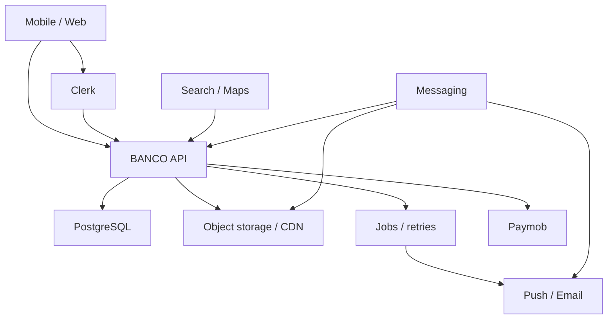

# BANCO MARKET — Master Stabilization State (A–J)

**Date:** 2026-08-09
**Repository root:** `/workspace/scratch/84295b972399/bancoboomstor`
**Base:** `main@36766cfc966de4d0c0b8d96a65bff299082ed143`
**Candidate under audit:** the preserved local working tree above that base
**Package manager:** `pnpm@11.9.0`
**Workspace proof:** `BANCO_WORKSPACE_OK`, one worktree, `changed_paths=122`

This report is the required A–J entry point for the attached Final Production
Master Stabilization Program. It does not replace
`RC1-VALIDATION-2026-08-09.md`; it organizes the current evidence and the next
repair order. Old reports and handoffs are leads only. Current code, current
diff, and tests on this tree remain the source of truth.

## A. Current system state

| Item | Current evidence | Classification |
|---|---|---|
| Canonical repository | One worktree; `main` tracks `origin/main`; remote Copilot/Claude audit refs were fetched read-only and were not switched to or merged | PROVEN |
| Base commit | `36766cfc966d` (`report: comprehensive bug report — all 8 open issues v4.1.4`) | PROVEN |
| Release candidate | Pre-commit scope is 122 paths over the recorded base; the user authorized one commit/push so CI can bind the final tree to one SHA | PRE-COMMIT PROVEN; CI PENDING |
| Tags | No tag is present in the current clone | PROVEN ABSENCE |
| Monorepo | 18 pnpm workspace projects; API, mobile, admin, dealer, landing, two Next surfaces, shared libraries | PROVEN |
| Original mobile app | `artifacts/banco-mobile`, Expo SDK 54 / React Native / Expo Router | PROVEN |
| Four account families | individual, business/dealer, bank, funder; bank/funder share FI role with distinct `fiType` | SOURCE + TEST PROVEN; LIVE CLERK UNPROVEN |
| Local compile | Literal `npm run build` passed after media, DB-gate, AUTH-account, PAYMENT-INTEGRITY, and operational-SoT hardening | PROVEN ON CURRENT CANDIDATE |
| Mobile static/render | 399/399, including 31/31 iOS render subset | PROVEN ON CURRENT CODE |
| Native bundling | Android and iOS Expo exports passed; no signed-device run | BUNDLE PROVEN; DEVICE UNPROVEN |
| API without DB | 202 DB-independent tests passed | PROVEN |
| API with PostgreSQL | The local runtime has no PostgreSQL executable; CI already injects a disposable PostgreSQL 16 `DATABASE_URL` | UNPROVEN ON THIS UNPUSHED CANDIDATE |
| Database strategy before deployment | CI provisions disposable PostgreSQL 16; Coolify compose provisions internal PostgreSQL 16 and constructs `DATABASE_URL`; Replit/Qualify may inject a different runtime URL later | PROVEN CONFIGURATION; LIVE RUNTIME UNPROVEN |
| Media security/performance wave | authenticated private media, MIME/size guards, native streaming upload, Range, virtualized galleries, ACL fast path, media limiter, deterministic write-once temp-to-final identity, and final-metadata retry after temp cleanup | SOURCE + 83 CURRENT DB-INDEPENDENT TESTS PROVEN; LIVE PROVIDERS UNPROVEN |
| Million-scale claim | No CDN derivative pipeline, distributed limiter, load profile, or production SLO proof | NOT PROVEN / NO-GO |

### Database decision

The final database host is deliberately **not** a source-code decision. The
application consumes one runtime contract: `DATABASE_URL`.

- Local/CI verification uses a disposable PostgreSQL 16 database and applies
  the committed migration history twice before seeding/tests, proving replay is
  idempotent instead of mutating schema through `push-force`.
- Coolify uses the internal `postgres` service and constructs the URL from
  `POSTGRES_USER`, `POSTGRES_PASSWORD`, and `POSTGRES_DB`.
- Replit or Qualify may supply a different value at runtime without a code
  change.
- No database URL, password, or provider-specific hostname may be committed.
- A new runtime URL proves connectivity only after migrations, seed, API tests,
  readiness, backup, restore, and rollback are exercised on the exact SHA.

## B. Ten mini-app inventory

The canonical count is not “every card currently visible in Discover”. Global
Supply and Supply Hub are business capabilities, not additional owner-count
mini-apps. Current routes and the production inventory establish these ten:

| # | Mini-app / bounded world | Canonical entry | Primary dependencies | Current status |
|---:|---|---|---|---|
| 1 | Discover | `/(tabs)/search` + `SearchDiscover` | taxonomy, search, navigation, section assets | SOURCE COMPLETE; live data unproven |
| 2 | B-oom Car | `/section/car` | search/facets, listings, maps, media | SOURCE COMPLETE; live scale unproven |
| 3 | B-PROPERTIES | `/section/real-estate` | search/facets, listings, maps, media | SOURCE COMPLETE; live scale unproven |
| 4 | BOOM STAY | `/section/booking` | rental search, bookings, maps, messaging | SOURCE COMPLETE; booking runtime unproven |
| 5 | Materials | `/section/materials` | industrial taxonomy, search, listings, maps | SOURCE COMPLETE; live scale unproven |
| 6 | Factories / Facilities | `/section/factories` | industrial taxonomy, search, listings, maps | FUNCTIONAL; premium header remains HOLD |
| 7 | Maps | `/section/maps` | location permission, search, coordinates, clusters | SOURCE COMPLETE; physical-device/provider scale unproven |
| 8 | Banks & Funders | `/business/banks` | FI onboarding/lifecycle, Clerk, PostgreSQL, admin | PARTIAL; live account lifecycle unproven |
| 9 | Car Import | `/import` | import orders/docs, private media, status, messaging | SOURCE COMPLETE; DB/storage runtime unproven |
| 10 | Accounts & Publishing | profile + `listings/create` + `listings/mine` | Clerk, `/me`, DB, storage, plans/payments | PARTIAL; live Clerk/payment/device gates remain |

Cross-cutting systems are not counted as extra mini-apps: messaging,
notifications, uploads/media, search, email, payments, jobs, and observability.

## C. Feature completeness matrix

`COMPLETE` below means complete in current source and local gates only. Overall
status remains `PARTIAL` whenever a live dependency or native-device journey is
not proved.

| Mini-app | UI | API | DB | Auth | Notifications/jobs | Mobile | Tests | Deployment | Overall |
|---|---|---|---|---|---|---|---|---|---|
| Discover | COMPLETE | COMPLETE | N/A/direct consumers | optional | behavior signals PARTIAL | COMPLETE | COMPLETE | UNPROVEN | PARTIAL |
| Car | COMPLETE | COMPLETE | SOURCE COMPLETE | COMPLETE | PARTIAL | COMPLETE | COMPLETE | UNPROVEN | PARTIAL |
| B-PROPERTIES | COMPLETE | COMPLETE | SOURCE COMPLETE | COMPLETE | PARTIAL | COMPLETE | COMPLETE | UNPROVEN | PARTIAL |
| BOOM STAY | COMPLETE | PARTIAL | SOURCE COMPLETE | COMPLETE | PARTIAL | COMPLETE | COMPLETE | UNPROVEN | PARTIAL |
| Materials | COMPLETE | COMPLETE | SOURCE COMPLETE | COMPLETE | PARTIAL | COMPLETE | COMPLETE | UNPROVEN | PARTIAL |
| Factories | COMPLETE | COMPLETE | SOURCE COMPLETE | COMPLETE | PARTIAL | COMPLETE | COMPLETE | UNPROVEN | PARTIAL |
| Maps | COMPLETE | COMPLETE | SOURCE COMPLETE | permission-dependent | N/A | COMPLETE | static COMPLETE | UNPROVEN | PARTIAL |
| Banks & Funders | COMPLETE | SOURCE HARDENED | migration 0004 + boot patch | SOURCE HARDENED; FI success now waits for idempotent workspace provisioning | PARTIAL | COMPLETE | focused COMPLETE; DB execution pending | UNPROVEN | PARTIAL |
| Car Import | COMPLETE | SOURCE COMPLETE | SOURCE COMPLETE | COMPLETE | PARTIAL | COMPLETE | focused COMPLETE | UNPROVEN | PARTIAL |
| Accounts & Publishing | COMPLETE | SOURCE COMPLETE | SOURCE COMPLETE | SOURCE COMPLETE | PARTIAL | COMPLETE | focused COMPLETE | UNPROVEN | PARTIAL |

Known cross-cutting statuses:

| System | Status | Evidence gap |
|---|---|---|
| Messaging | polling architecture preserved; source/test pass | live long-thread, offline/retry, push/deep-link and load profile |
| Media | immutable final identity is implemented across S3 and GCS/Replit; every durable consumer stores the returned final URL; retries read final metadata when settlement already removed temp | live storage copy/overwrite exercise, CDN derivatives, load/device profile |
| Payments | client confirm is read-only; Intention order id is mandatory and pre-bound; webhook routing refuses unsigned merchant-id first binding; refunds are durably held for authoritative amount reconciliation; void remains automatic | real Paymob callback/HMAC/inquiry/replay proof and reconciliation completion on staging |
| Email | provider integration present | real delivery, retry and failure-isolation proof |
| Push notifications | source/config present | signed Android/iOS delivery and routing proof |
| Background jobs | code-level inventory incomplete | queue isolation, retries, idempotency and worker runtime proof |

## D. Agent contribution matrix

Git authorship proves who committed, not who originally suggested a change.
Handoff claims without current-code/test evidence remain `UNKNOWN`.

| Contributor evidence | Proven contribution | Current disposition |
|---|---|---|
| Claude — 145 commits in all-history shortlog | headers, maps, messenger fixes, mobile guards/build work, forensic handoffs | Many changes merged into current ancestry; only current guards/runtime determine validity |
| Banco Group — 39 commits | integration, conflict repair, FI lifecycle hardening, current v4.1.4 reports | Current `main` ancestry / source of base truth |
| Replit Agent — 8 commits | FI workspace lifecycle and related implementation | Merged; later hardened by Banco commits and tests |
| Current Codex local wave | 122-path candidate: package/workspace guards, accounts, immutable media/ACL/range/upload/performance, migration-authority gates, Paymob binding/refund safety, deployment-SoT repair, secret redaction, reports | Preserved and authorized for one commit/push; local gates complete, CI pending |
| Cursor | Historical handoffs describe UI recovery and branch mistakes | No current branch/author proof in this clone; treat handoffs as leads |
| Copilot | Docs-only audit commit `ff6638b` on `copilot/full-audit-primary-agent-report` | Read and independently reconciled; no Copilot code was merged. PR #8 fixes are already present through the local candidate, while its stale-SoT finding was expanded and repaired |

No whole-tree merge, blind cherry-pick, reset, or branch recovery is authorized.

## E. Historical regression matrix

| Regression | Historical evidence | Current evidence | State |
|---|---|---|---|
| Discover image cards replaced by ENTER rows | July damage-chain handoff | `SearchDiscover` has 2×2 photo cards and route isolation guard | CLOSED |
| BOOM STAY identity replaced by unauthorized black header | July damage-chain handoff | dedicated booking route/header and guard | CLOSED |
| Maps controls hidden under lower chrome | commits `127e3d7`, `a4c1eb0` | Maps hub + section map guards | CLOSED IN SOURCE |
| Messenger send icon rendered as V; presence absent | commits `9f04383`, `f045d27`, `98b74d9` | current messenger guards/render tests | CLOSED IN SOURCE |
| Merge conflict markers in import screens | `7a47b94` | repository marker scan passed | CLOSED |
| FI workspace unsafe transitions/schema drift | `7565186` then `3170eec`…`fa02371` | migration 0004, locks, unique owner, boot-cycle tests | CLOSED IN SOURCE; LIVE DB UNPROVEN |
| Clerk key/redirect source drift | August issue report | canonical publishable-key guards and account journey tests | SOURCE CLOSED; TENANT UNPROVEN |
| Uploads allowed unsafe public hosting/private cache | current local wave | MIME/ACL/private-cache/origin tests | CLOSED LOCALLY |
| Large video upload/galleries exhausted mobile memory | current local wave | native stream upload, virtualization, active-player guard | CLOSED LOCALLY; DEVICE UNPROVEN |
| Verified upload could be overwritten using reusable presigned PUT | current audit | source ETag/generation is pinned, destination is create-only, all durable consumers store `/objects/final/<uuid>`, retries validate deterministic-final metadata after temp deletion, and owner mismatch is tested | CLOSED IN SOURCE; LIVE PROVIDER PROOF PENDING |
| FI role returned before its workspace existed | current AUTH-ACCOUNT audit | every FI profile retry synchronously awaits idempotent workspace provisioning before `PATCH /me` succeeds | CLOSED IN SOURCE; POSTGRESQL EXECUTION PENDING |
| Stale profile write could race deletion/demotion | current AUTH-ACCOUNT audit | the SQL `UPDATE` now rejects tombstones and stale personal writes after FI/company promotion | CLOSED IN SOURCE; POSTGRESQL EXECUTION PENDING |
| Media cleanup exception skipped Clerk deletion | current AUTH-ACCOUNT audit | post-commit media cleanup is isolated and Clerk deletion is still attempted; behavioral test added | CLOSED IN SOURCE; POSTGRESQL EXECUTION PENDING |
| First Paymob webhook could bind through unsigned merchant intent | current PAYMENT-INTEGRITY audit | Intention creation now requires `intention_order_id`; webhook routing requires the pre-bound signed `order.id` and returns 503 when absent | CLOSED IN SOURCE; LIVE PAYMOB UNPROVEN |
| Partial refund treated signed original `amount_cents` as refund delta | current PAYMENT-INTEGRITY audit | refund callbacks set a durable reconciliation marker, block late settlement, and surface a critical admin alert; no wallet/subscription mutation occurs without authenticated inquiry | UNSAFE AUTO-CLAW CLOSED; RECONCILIATION EXECUTION PENDING |
| Live deployment guidance pointed to a retired repository | Copilot handoff plus repository-wide operational scan | 14 active Coolify/cutover/status/Cloudflare surfaces name `bancoboomstor`; a negative chain guard failed before the repair and now passes | CLOSED IN CURRENT SOURCE |

## F. Build / CI failure matrix

| Gate | Current result | Meaning / limitation |
|---|---|---|
| Workspace identity | PASS | correct root/branch/base/pnpm; dirty scope preserved |
| Literal root `npm run build` | PASS after PAYMENT-INTEGRITY + operational-SoT repair | compile/bundle only; not live services |
| Production confidence | 25/25 PASS | local scripted gates |
| Chain integrity | 215/215 PASS | historical/source guards, including 14 canonical-deploy-repository checks |
| Mobile regression | 399/399 PASS | static + render; not signed device |
| API media focused | current rerun 73/73 DB-independent PASS, 3 live-provider tests skipped; earlier broader focused pack was 83/83 | live storage sidecar/bucket not exercised; DB-backed import/account cases remain in PostgreSQL gate |
| API payment focused | 6/6 DB-independent PASS | controller/provider binding, refund hold, and void routing; DB behavior and live Paymob remain pending |
| Full API/PostgreSQL local | 202 DB-independent tests passed in the last broad attempt; 55 DB-backed suites require PostgreSQL | exact candidate still needs the disposable PostgreSQL 16 job |
| GitHub CI | workflow provisions PostgreSQL 16, validates migration history, applies `migrate` twice, seeds, then runs the full API suite | authorized commit/push is the next gate; no result may be claimed before that exact SHA runs |
| Website CI | 18/18 PASS | local website build/smoke |
| Docker image matrix | workflows and Dockerfiles exist | current dirty candidate not built/run in Docker here |
| EAS signed production | not run | native export is not store signing/device proof |

There is no unexplained local build failure. There are explicit unexecuted
integration gates; they must not be renamed as passing.

## G. Deployment blocker matrix

| ID | Priority | Blocker | Root cause | Required proof |
|---|---|---|---|---|
| DEP-01 | P0 | Live immutable-storage proof | the source defect is closed locally, but no configured S3 bucket or Replit sidecar was exercised on this candidate | on each live provider: upload A, finalize, overwrite/recreate temp with B, prove final remains A; retry after temp deletion; owner-mismatch rejection; cleanup |
| DEP-02 | P0 | Exact-SHA PostgreSQL execution | the gate is now migration-authoritative and idempotency-checked, but the local candidate is not committed/pushed and this runtime has no PostgreSQL process | authorize an immutable candidate commit, then require PostgreSQL 16 migrate×2 + seed + full API suite on that exact SHA |
| DEP-03 | P0 | Live Clerk/account proof | source tests cannot prove tenant keys/domains/redirects/providers; Clerk keys were present in tracked historical reports and are now redacted only at the current tip; failed Clerk deletion has no durable retry queue; every `ADMIN_EMAILS` entry auto-promotes to Owner on `/me` | rotate the exposed Clerk keys, inject a paired tenant securely, review the exact Owner allowlist, and prove all four account journeys plus deletion/retry on staging |
| DEP-04 | P0 | Payment settlement/reconciliation proof | source now fails closed on unbound orders and unsafe refund amounts, but no live Paymob callback or authenticated transaction inquiry ran; success notifications still lack a durable outbox | signed Paymob success/decline/void/refund callbacks; replay; transaction inquiry for cumulative partial refunds; clear reconciliation marker only after exact ledger/subscription adjustment; prove no client-confirmable credit and no lost notification on process restart |
| DEP-05 | P1 | Million-scale media delivery | no proved CDN derivatives/posters/cache-hit/egress profile | range-aware CDN, responsive images/posters, origin shielding, measured load profile |
| DEP-06 | P1 | Horizontal abuse control | Express limiter store is process-local | edge/WAF or distributed store; multi-replica test |
| DEP-07 | P1 | Docker/Coolify runtime | configuration exists but was not run on this candidate | image builds, migration job, health/ready, restart, backup/restore, rollback |
| DEP-08 | P1 | Native production journeys | exports are unsigned and not physical-device tests | signed low/mid/high Android + iOS journey matrix |
| DEP-09 | P1 | Android notification glyph | approved monochrome transparent asset is absent | owner-approved asset, rebuild, physical-device notification proof |

## H. Cross-service dependency graph

| Producer/change | Mandatory consumers to regress |
|---|---|
| Upload finalization | listings + posters, company logo/cover, profile cover, KYC, chat, import documents, delete cleanup, mobile upload contracts |
| Auth/account role | mobile routing, API RBAC, FI workspace, admin, Clerk metadata, session restore |
| Listing/search contract | feed, Discover, five catalogue worlds, Maps, saved items, ads/contact |
| Messaging state | conversation list, thread, unread/read, notification, deep link, media ACL |
| DB schema/index | API startup patches, migrations, seed, CI, Coolify migrate, rollback |
| Payment event | wallet/subscription, invoice, notification, audit/idempotency |

## I. P0 / P1 / P2 priority plan

### P0 — release integrity

1. Exercise the implemented immutable upload finalization on configured S3 and Replit/GCS storage.
2. Disposable PostgreSQL 16 gate for every DB-backed suite and migration path.
3. Staging Clerk/account lifecycle for all four account families.
4. Paymob signed settlement/replay plus authenticated partial-refund inquiry and reconciliation proof.

### P1 — production capacity and operations

1. CDN image/video derivatives, cache policy, origin shielding, and measured load.
2. Distributed rate limiting/backpressure and horizontal API/DB pool model.
3. Messaging/notification/email job isolation, retry and idempotency proof.
4. Docker/Coolify build, runtime, backup, restore and rollback.
5. Signed native-device matrix, crash/memory/weak-network measurements.

### P2 — non-blocking polish after integrity

1. Admin/dealer bundle splitting and source-map warning cleanup.
2. Approved notification glyph and remaining visual/device polish.
3. Documentation drift cleanup only where it changes operator decisions.

## J. Exact execution order

1. **MEDIA-IMMUTABLE-1 — COMPLETE LOCALLY:** provider-neutral temp-to-final
   primitive, source-version pinning, create-only destination, focused S3 and
   GCS/Replit tests.
2. **MEDIA-IMMUTABLE-2 — COMPLETE LOCALLY:** public/private finalizers return
   immutable final URLs; listing, company, profile cover, KYC, chat, and import
   consumers persist them before durable references are written.
3. **MEDIA-IMMUTABLE-3 — COMPLETE LOCALLY:** retry after temp deletion,
   including authoritative final-metadata fallback for listings, companies,
   KYC, chat, and import; idempotent conflict handling, temp cleanup, owner
   mismatch, legacy URL compatibility, and client propagation.
4. **DB-GATE-1 — IMPLEMENTED, EXECUTION PENDING:** CI, deploy verification, and
   the local disposable-DB runner now validate committed migrations, apply them
   twice, seed, and execute the full suite. Running it on the exact candidate
   requires an authorized commit/push or an injected local PostgreSQL URL; it
   does not wait for a final Replit/Qualify URL.
5. **AUTH-ACCOUNT — LOCALLY HARDENED; LIVE PENDING:** FI success now waits for
   its idempotent workspace, profile writes reject concurrent tombstones/stale
   demotions atomically, and storage cleanup cannot skip Clerk deletion. Source
   guards are 18/18; the new deletion behavior test awaits PostgreSQL. Stage one
   Clerk tenant and prove signup/session/restore/logout/deletion for individual,
   business, bank, and funder; decide the exact `ADMIN_EMAILS` Owner allowlist.
6. **PAYMENT-INTEGRITY — LOCALLY HARDENED; LIVE/RECONCILIATION PENDING:**
   client confirmation remains read-only; every new checkout requires and stores
   Paymob `intention_order_id`; signed webhooks route only through that binding.
   Refunds no longer misuse original `amount_cents` as a partial-refund delta:
   they set a durable reconciliation marker, block late settlement, and raise a
   critical admin alert while voids remain full automatic reversals. Next prove
   real HMAC callbacks/replays, authenticated transaction inquiry, exact
   reconciliation, and a durable notification/email outbox.
7. **OPS-SOT — CLOSED LOCALLY:** the live Coolify, cutover, status, Cloudflare,
   and repository-status surfaces now point only to `bancoboomstor`; historical
   predecessor references remain only where explicitly labelled as archive.
   The 14-surface chain guard failed on the old tree and now passes.
8. **SCALE:** add/prove CDN derivatives, distributed abuse controls, query/load
   profiles and SLOs; size DB pools against replica count.
9. **DEPLOY:** build/run Coolify images, migrate, health/ready, restart,
   backup/restore and rollback on the exact commit.
10. **NATIVE:** signed Android/iOS builds and physical-device journeys.
11. **RC1:** rerun all local/CI/live gates on one immutable commit and issue the
    final `RC1 READY` or blocker-by-blocker `RC1 NOT READY` certification.

## Current decision

**RC1 NOT READY.** The mutable-upload, account-race, Paymob first-bind, and
unsafe partial-refund auto-claw defects are closed in source and their
DB-independent gates are green. `DEP-01` still
requires a configured live-provider exercise; `DEP-02` through `DEP-04` remain
unresolved P0 release gates. `DB-GATE-1` is implemented but not executed on this
pre-commit candidate; its next proof is the PostgreSQL 16 CI job on the
authorized immutable SHA. It consumes an injected disposable `DATABASE_URL`
and does not depend on choosing the final Replit, Qualify, or Coolify database
host.
